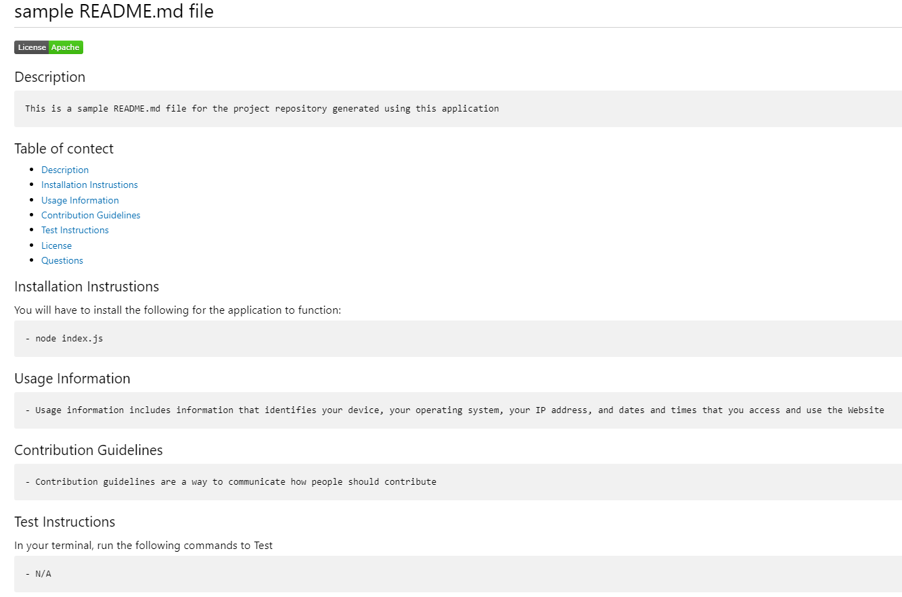

# README Generator

This a simple application helps users create a project Readme file quickly and easily.
Users will just need to follow the command lines and a README.md file will be created automatically after finish the questions.

# Sample README.md file

The sample file can be find [here](sample/README.md)

# Walkthrough Video

A walkthrough video can be viewed through the [link](https://drive.google.com/file/d/1XrCZvu3mPnn-pGolY8rd0qJOu3ySk1FI/view)

# Screenshot

